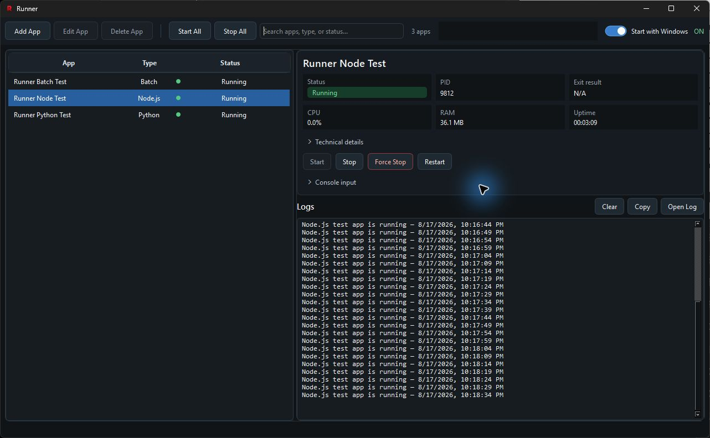
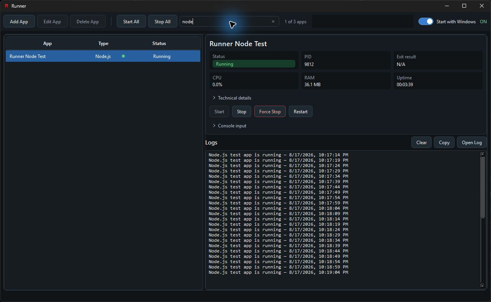
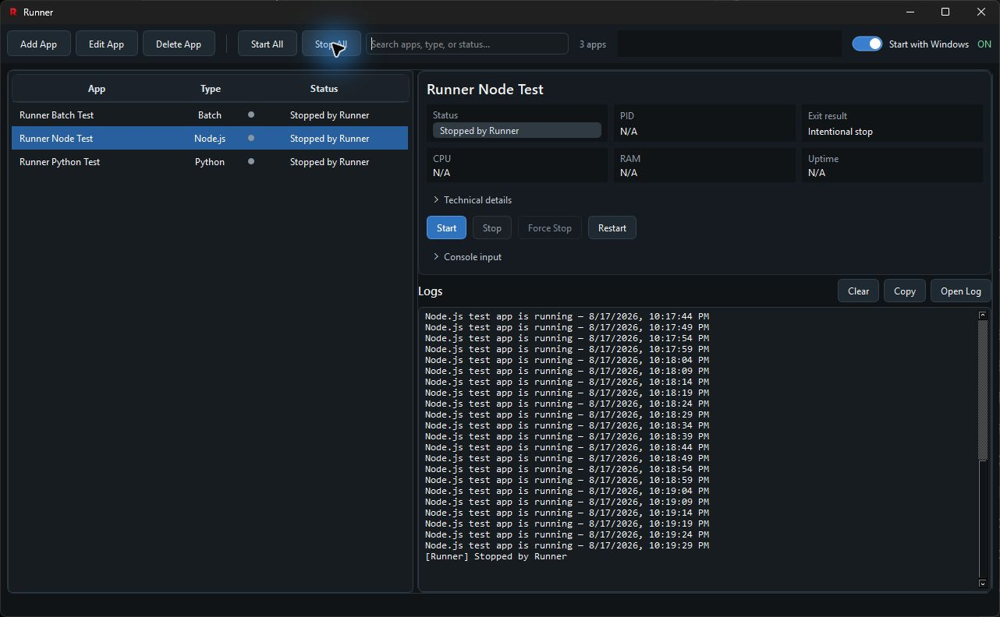

# Runner

Runner is a lightweight Windows process manager for local applications. It can launch, monitor, stop, and restart Python, Node.js, Batch, command, and executable files from one native PySide interface.



## Download

Download the installer from [Releases](https://github.com/mrwzi/Runner/releases/latest), or use the visible repository copy at [`installer/RunnerSetup.exe`](installer/RunnerSetup.exe).

## Screenshots

| Search and filtering | Intentional stop handling |
| --- | --- |
|  |  |

## Supported launchers

| File type | Command |
| --- | --- |
| `.py` | `python -u file.py` |
| `.js`, `.mjs` | `node file.js` |
| `.bat`, `.cmd` | `cmd /D /C file.bat` |
| `.exe` | Executed directly |

Runner keeps the selected app folder as the child process working directory. It displays process status, PID, CPU, RAM, uptime, recent logs, and exit results. Live log history is bounded to keep memory use low.

## Run from source

Requirements:

- Windows 10 or newer
- Python 3.10+
- Node.js only when running JavaScript apps

```powershell
py -m venv .venv
.\.venv\Scripts\Activate.ps1
python -m pip install -r build\requirements.txt
python launcher\run.py
```

Local app definitions, UI state, and logs are stored under `.runner_runtime` when running from the source tree. That directory is intentionally excluded from Git.

## Build

Install the build dependency:

```powershell
python -m pip install -r build\requirements-build.txt
```

Build Runner:

```powershell
powershell -ExecutionPolicy Bypass -File build\build-runner-only.ps1
```

Build Runner and UpdateRunner:

```powershell
powershell -ExecutionPolicy Bypass -File build\build.ps1
```

Building `RunnerSetup.exe` additionally requires Inno Setup 6:

```powershell
powershell -ExecutionPolicy Bypass -File build\build-installer.ps1
```

## Repository layout

- `launcher/` — application entry point and runtime-path handling
- `manager/` — process lifecycle, monitoring, input, and log capture
- `ui/` — native PySide interface
- `build/` — build, updater, startup-task, and installer sources
- `assets/` — application icons
- `config/apps.json` — intentionally empty seed configuration
- `screenshots/` — coordinated public interface screenshots

Generated executables, build environments, runtime data, logs, and machine-specific PyInstaller files are excluded by `.gitignore`.
